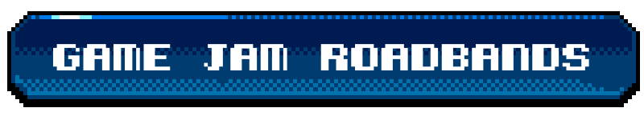
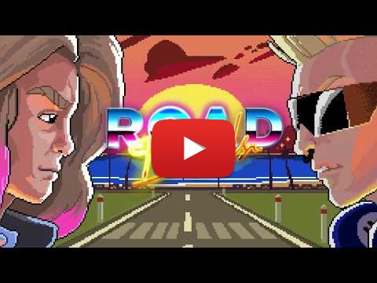
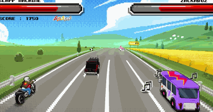
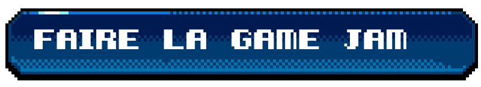
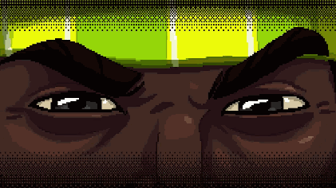
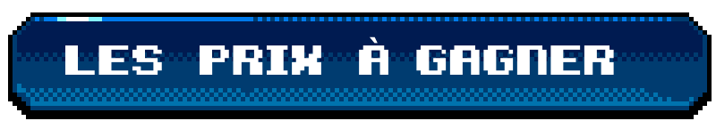
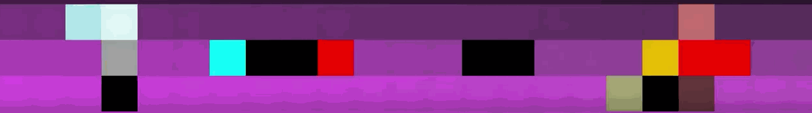
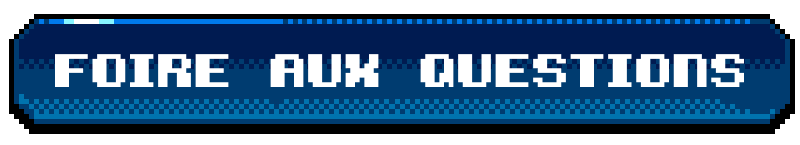

    

hotelF1, réseau de motels à la française du groupe AccorHotels, va toujours plus loin dans l’univers de l’entertainment en proposant un jeu vidéo rétro (mobile et web) autour du road trip ! Dans Road Bands, vous devez aider un groupe de musique à retrouver leurs instruments et affronter leurs némésis. Mais attention, Road Bands n’est pas qu'un simple jeu vidéo, c’est un vrai projet collaboratif. Nous avons créé les 2 premiers niveaux, à vous de créer la suite !

## Sommaire

- [Jouer au jeu](#jouer-au-jeu)
- [Faire la Game Jam](#faire-la-game-jam)
- [Les prix à gagner](#les-prix)
- [FAQ](#faq)

    

À la sortie d’un festival, le groupe de glam rock Slapp Machine décide de partir en road trip pour composer leur nouvel album. Mais les membres du groupe rival, les Zackhøuz, leur ont volé leurs instruments. Les Slapp Machine vont alors s’embarquer dans une course poursuite endiablée à travers des niveaux déjantés, mêlant runner et niveaux de boss, afin de récupérer leurs précieux instrus.

* Évitez les véhicules sur la route et rattrapez le van des Zackhøuz
* Affrontez Max le manager véreux lors d’une épique bataille de sandwichs triangle
* Remplissez le réservoir de votre van le plus vite possible

    

Les Slapp Machine ont besoin de vous ! Retrouvez les deux premiers niveaux de Road Bands [sur Android](https://play.google.com/store/apps/details?id=fr.hf1.roadband) et [sur iOS](https://itunes.apple.com/app/id1256521725), ou sur [roadbands.com](http://www.roadbands.com) tout de suite et gratuitement !

    

    

    

    

Roadbands est un jeu collaboratif. Cela signifie que VOUS allez pouvoir créer les niveaux de vos rêves, et, s'ils sont sélectionnés, être récompensé(e) par de nombreux prix ! De plus, vos niveaux feront parti de la version finale du jeu disponible sur internet et smartphone.

Pour commencer, nous vous conseillons fortement de lire [la page d'aide à la prise en main du projet Unity](https://github.com/ROADBANDS/GAMEJAM/blob/master/Tuto.md) où vous trouverez toutes les réponses à vos questions techniques.

Le niveau que vous allez créer devra être soumis avant le **dimanche 1er octobre 23h59** sur cette page : http://www.roadbands/gamejam/formulaire.fr

Afin de rester cohérent avec le reste du jeu, votre niveau devra :
- être jouable en webGL et sur smartphone
- comporter une phase d'échauffement et une phase de boss
- renseigner un score à la fin

Un petit tutoriel en introduction est aussi plus que bienvenue ! ;-)

Pour plus d'informations sur les détails juridiques du concours, vous pouvez consulter [le règlement complet ici](https://github.com/ROADBANDS/GAMEJAM/blob/master/reglement-de-concours.pdf).

    

    

À la fin de la Game Jam, tous vos niveaux seront testés par un jury qui en sélectionnera 8. Ces niveaux seront ensuite intégrés par nos équipes dans le jeu final, faisant de Road Bands un véritable jeu collaboratif ! Le jury devra décerner un prix à chacun des niveaux sélectionnés suivant son ordre de préférence.

- **Premier prix** : une mini borne d’arcade Neo Legend d’une valeur indicative de 1500 € TTC
- **Deuxième et troisième prix** : une console de jeu Nintendo Switch d’une valeur indicative de 329,99€
- **Quatrième et cinquième prix** : une console de jeu  E-CONCEPT SEGA MEGA DRIVE d’une valeur indicative de 59,99 €
- **Du sixième au huitième prix** : une console de jeu E-CONCEPT ATARI FLASHBACK 7 d’une valeur indicative de 54,99 €

    

### Comment créer mon niveau de Roadbands ?
Toutes les réponses à vos questions [sont ici](https://github.com/ROADBANDS/GAMEJAM/blob/master/Tuto.md) ;-)

### Jusqu'à quelle date puis-je participer ?
La date limite de soumission de votre niveau est le dimanche 1er octobre 2017 à 23h59.

### Puis-je participer seul(e) ?
Absolument. 

### Jusqu'à combien de personnes peut compter mon équipe ?
Il n'y a pas de taille limite aux équipes, tous vos fans peuvent vous accompagner.

### À qui dois-je envoyer mon niveau une fois celui-ci fini ?
Une fois terminé, faites une archive .zip de votre projet Unity et postez-la ici : http://www.roadbands/gamejam/formulaire.fr. 

### Puis-je créer plusieurs niveaux ?
Oui, mais nous vous conseillons de privilégier la qualité à la quantité :-)

    

